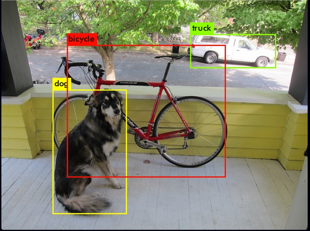
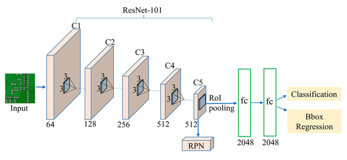
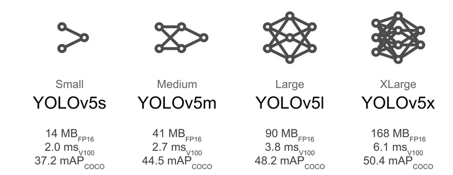

# Project Workflow and how it works

- User - what everyone sees
- Yolo model - what happens in the back

# User interface

- Flask:
    - Python framework for creating web applications
    - Generates the user interface
    - Runs the model

# Algorithm

- Yolov5 by ultralitics [Link](https://github.com/ultralytics/yolov5):
    - Great YOLO algorithm implementation
    - Great documentation
    - Transfer Learning
    - Inference

# Yolo Algorithm

- Used for object detection (detect objects in an image and place a box around them)

{width=50%}

# Yolo Algorithm

{width=70%}

# Yolo Algorithm



# Workflow

0. Get the data and in the correct format:


```
- dataset_folder
  - Train
    - imgS.jpg
    - ...
  - Validation
    - imgA.jpg
    - ...
  - Test
    - imgB.jpg
    - ...
```

# Workflow


0. Get the data and in the correct format:


```
data.yaml file

train: ./asl_dataset/train/images
val: ./asl_dataset/valid/images
test: ./asl_dataset/test/images

nc: 26
names: ['A', 'B', 'C', 'D', 'E', 'F', 'G', 'H', 'I', 'J', 'K', 'L', 'M', 'N', 'O', 'P', 'Q', 'R', 'S', 'T', 'U', 'V', 'W', 'X', 'Y', 'Z']

```


# Workflow

1. Train the model using transfer learning

```bash
#!/bin/sh
python train.py \
    --batch 32 \
    --weights yolov5l.pt \
    --data data.yaml \
    --epochs 100 \
    --img 320 \
    --patience 5 \
    --device 0 \
    --cache \
    --freeze 10\
    --adam \
    --hyp  data/hyps/hyp.finetune.yaml \
```

# Workflow

2. Evaluate the model on the validation data
3. Hyper parameter optimization

# Workflow

4. Test the model in a real time scenario

The model is then loaded in the flask application
```python
model = torch.hub.load("ultralytics/yolov5", "yolov5s")
```

# Final product

```python
image = self.model(frame, size=640)
names = image.names
coord = image.xyxy[0].detach().cpu().numpy()
for (x1, y1, x2, y2, conf, name) in coord:
    cv2.rectangle(
        frame,
        (int(x1), int(y1)),
        (int(x2), int(y2)),
        (255, 245, 67),
        2,)
    cv2.putText(
        frame, ...)
```


